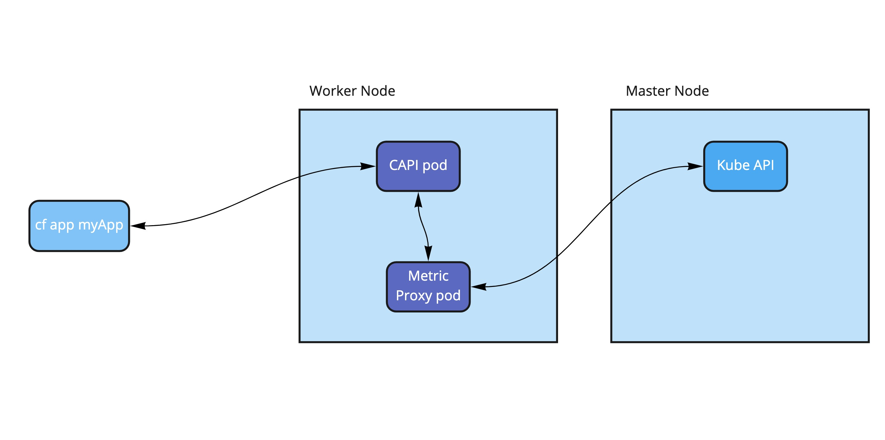

# metric-proxy

The metric-proxy acts as a translation layer between the Kubernetes Metrics
Server and CAPI for use in
[cf-for-k8s](https://github.com/cloudfoundry/cf-for-k8s). When a request comes
into the metric-proxy the proxy will make a request to the Kube API and format
the results to match the existing [log-cache API](https://github.com/cloudfoundry/log-cache)
This ensures developers can get metrics from existing versions of the cf cli
when running commands `cf push` and  `cf app`.

## Usage

Push an application and see its metrics with `cf push <app_name>`
```
$ cf push diego-docker-test -o cloudfoundry/diego-docker-app

Pushing from manifest to org system / space system as admin...
Getting app info...
Updating app with these attributes...
  name:                diego-docker-test
  docker image:        cloudfoundry/diego-docker-app
  disk quota:          1G
  health check type:   port
  instances:           1
  memory:              1G
  stack:               cflinuxfs3
  routes:
    diego-docker-test.example.com

Updating app diego-docker-test...
Mapping routes...
timeout connecting to log server, no log will be shown


Stopping app...

Waiting for app to start...

name:                diego-docker-test
requested state:     started
isolation segment:   placeholder
routes:              diego-docker-test.example.com
last uploaded:       Fri 06 Mar 16:03:06 MST 2020
stack:
docker image:        cloudfoundry/diego-docker-app

type:           web
instances:      1/1
memory usage:   1024M
     state     since                  cpu    memory        disk      details
#0   running   2020-03-09T15:33:37Z   0.3%   27.2M of 1G   0 of 1G
```


Get application metrics using `cf app <app_name>`
```
$ cf app diego-docker-test

Showing health and status for app diego-docker-test in org system / space system as admin...

name:                diego-docker-test
requested state:     started
isolation segment:   placeholder
routes:              diego-docker-test.example.com
last uploaded:       Fri 06 Mar 16:03:06 MST 2020
stack:
docker image:        cloudfoundry/diego-docker-app

type:           web
instances:      1/1
memory usage:   1024M
     state     since                  cpu    memory        disk      details
#0   running   2020-03-06T23:03:08Z   0.3%   27.1M of 1G   0 of 1G
```

## Metric Details

The kubelet reports CPU usage in millicores (thousandths of a core). See
[Kubernetes docs](https://kubernetes.io/docs/concepts/configuration/manage-compute-resources-container/#meaning-of-cpu)
for more details. This is reported as a percentage in the Cloud Foundry CLI.

For backwards compatibility, `disk` usage is still presented in the output but
will always return 0 as there is no equivalent pod metric in Kubernetes.




## How to Contribute/Develop metric-proxy

There are several scripts to help automate building and deploying new versions
of `metric-proxy`.

`./hack/build-dev-image.sh` — runs tests and builds and pushes a new docker image to
`oratos/metric-proxy:dev`

`./hack/bump-cf-for-k8s.sh` - updates the vendired metric-proxy
directory in the `cf-for-k8s` repo with any changes made to metric-proxy

`./hack/cf_for_k8s_env_deploy.sh` - helper script to create a GCP K8s cluster,
deploy cf-for-k8s, and update DNS records. Update this script with your GCP
Service Account key and DNS information.

`./hack/cf_for_k8s_login.sh` - helper to cf login to your cf-for-k8s
deployment using CF CLI v7

Confirm metric-proxy works by following steps in the Usage section.

See [Concourse CI](https://loggregator.ci.cf-app.com/teams/main/pipelines/metric-proxy).
